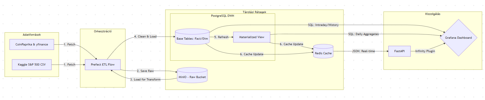

# Kriptovaluta és részvény adatok elemzése - Data Engineering Opcionális házi feladat

## Rövid leírás
A projekt célja egy automatizált adatfolyam megvalósítása, amely tőzsdei és kriptovaluta piaci adatokat gyűjt össze és rendszerez közös platformra. Az adatokat külső REST API-kból (CoinPaprika, yfinance) és statikus forrásból (Kaggle S&P 500 CSV) nyeri ki. A pipeline feladata a nyers adatok tisztítása, egységesített csillag sémába rendezése, valamint az adatok hatékony kiszolgálása PostgreSQL adattárház és Redis cache segítségével, vizuális megjelenítéssel (Grafana) kiegészítve.

## Architektúra és Adatmodell
A projekt **Medallion Architecture** elveket követ:
- **Bronze (Raw):** Nyers adatok a MinIO-ban.
- **Silver (DWH):** Tisztított adatok PostgreSQL-ben, csillag sémába rendezve (`intraday_price_fact`, `asset_dim`, `date_dim`).
- **Gold (Serving):** Aggregált adatok Materialized View-ban és Redis cache-ben a gyors kiszolgálás érdekében.



---

## 1. Hallgató adatai

|                |                       |
| -------------- | --------------------- |
| **Név**        | Sőrés Barna           |
| **Neptun-kód** | CASI6C                |
| **E-mail**     | sores.barni@gmail.com |

---

## Telepítés és Futtatás (Docker)

A teljes környezet reprodukálható és automatizált. Mivel minden komponens (az adatbázisok, a Python alkalmazás és az ütemező is) Docker konténerekben fut, a rendszer egyetlen paranccsal elindítható.

### 0. Kaggle API Token igénylés

A S&P 500 adatok letöltéséhez szükség van egy Kaggle fiókra. A [Kaggle Settings](https://www.kaggle.com/settings) oldalon az "API Tokens" résznél generálj egy újat.

### 1. Környezeti változók (.env)

A futtatás előtt szükség van a környezeti változók beállítására. Létre kell hozni egy `.env` fájlt a `docker-compose.yaml` fájllal egy szinten az alábbi tartalommal:

```env
POSTGRES_PORT=5432
POSTGRES_DB=data-engineering
POSTGRES_USER=user
POSTGRES_PASSWORD=data-engineering-pwd
REDIS_PASSWORD=data-engineering-pwd
MINIO_ROOT_USER=useradmin123
MINIO_ROOT_PASSWORD=data-engineering-pwd
MINIO_RAW_BUCKET=raw
GRAFANA_USER=user
GRAFANA_PASSWORD=data-engineering-pwd
KAGGLE_API_TOKEN=[IDE_MÁSOLD_A_TOKENEDET]
```

### 2. Indítás

Ki kell adni az alábbi parancsot az `Infrastructure` mappában:

```bash
docker compose up -d --build
```

A parancs hatására minden szolgáltatás elindul, az adatbázis sémák inicializálódnak és megkezdődik az automatikus adatgyűjtés.

### Side note / Warning

A számítógép operációs rendszerétől és jogosultságaitól függően előfordulhat, hogy a MinIO mc (client) scriptje Permission Denied hibát ad az automatikus indításkor. Ebben az esetben a raw bucket nem jön létre automatikusan és nem lesz publikus, ami megállítja az adatfolyamot.

A hiba manuális javítása:

Lépj be a futó MinIO MC konténerbe:

```bash
docker exec -it minio-data-engineering /bin/sh
```

Add ki soronként az alábbi utasításokat:

```bash
mc alias set myminio http://minio:9000 useradmin123 data-engineering-pwd
mc mb --ignore-existing myminio/raw
mc anonymous set public myminio/raw
```

### Elérhetőségek

| Szolgáltatás      | URL                        |
| ----------------- | -------------------------- |
| Grafana Dashboard | http://localhost:3000      |
| Prefect UI        | http://localhost:4200      |
| FastAPI Swagger   | http://localhost:8000/docs |
| MinIO Console     | http://localhost:9001      |

### (Opcionális) Python app manuális futtatás

Amennyiben a Python alkalmazást manuálisan szeretnéd futtatni, javasolt egy virtuális környezet létrehozása és utána a requirements.txt-ben lévő csomagok telepítése.

Hozz létre egy .env fájlt a requirements.txt mellett az alábbi tartalommal:

```env
REDIS_PORT=6379
REDIS_PASSWORD=data-engineering-pwd
POSTGRES_PORT=5432
POSTGRES_DB=data-engineering
POSTGRES_USER=user
POSTGRES_PASSWORD=data-engineering-pwd
MINIO_ROOT_USER=useradmin123
MINIO_ROOT_PASSWORD=data-engineering-pwd
MINIO_RAW_BUCKET=raw
MINIO_DWH_BUCKET=dwh
KAGGLE_API_TOKEN=[IDE_MÁSOLD_A_TOKENEDET]
```
